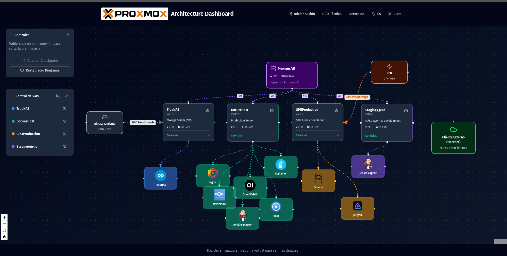
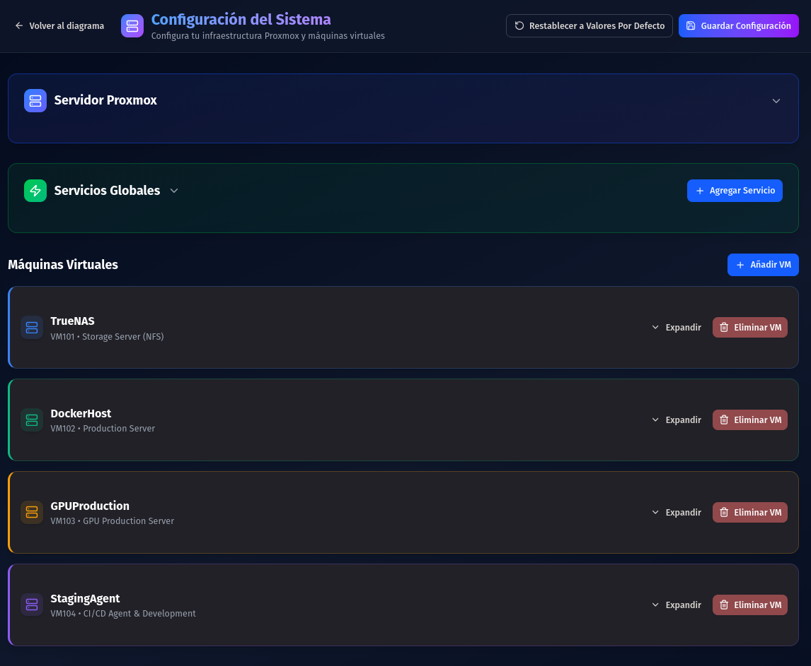
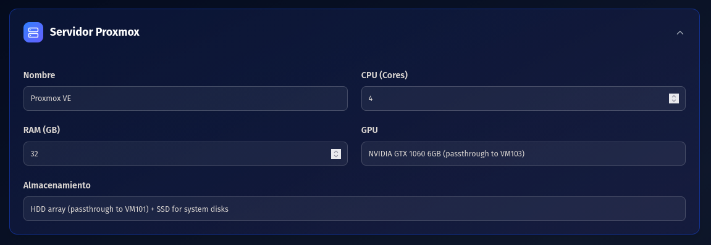
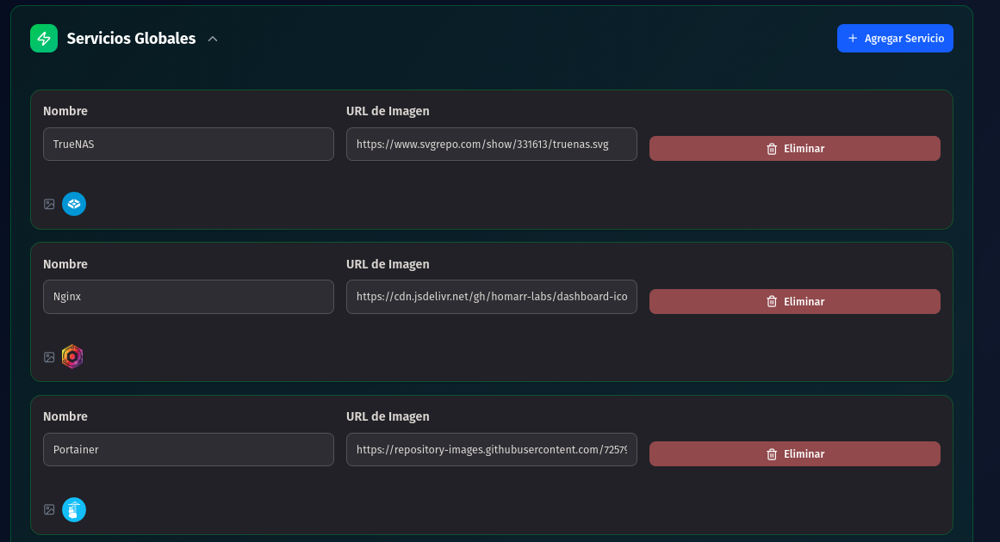
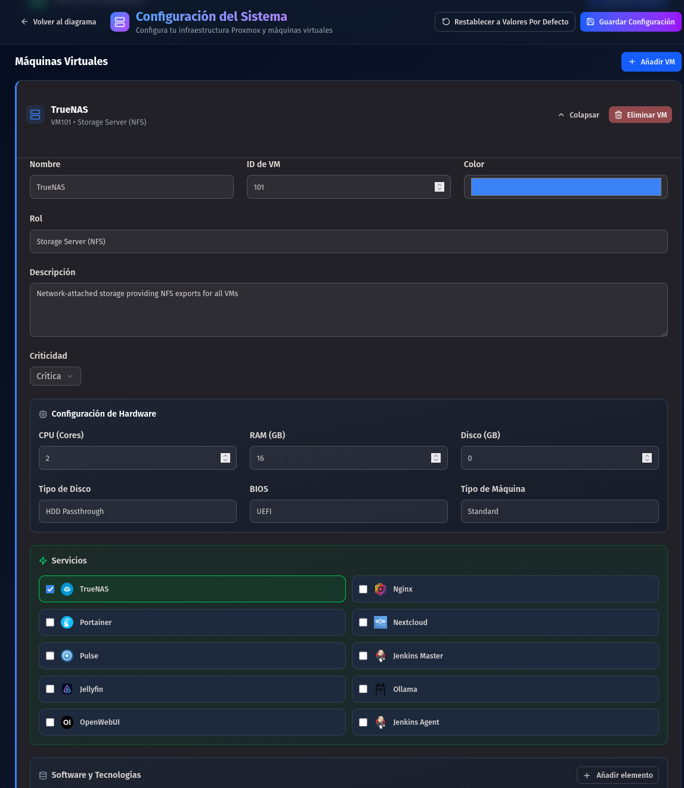
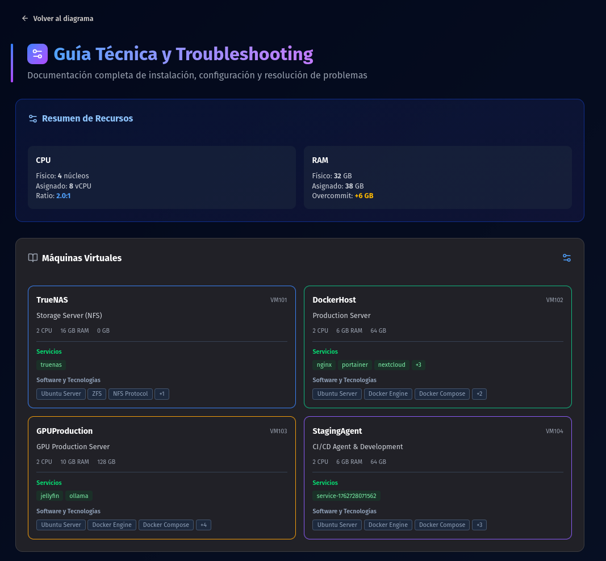
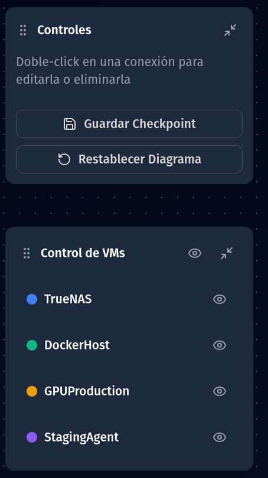

# Architecture Dashboard

[🇪🇸 Español](#español) | [🇬🇧 English](#english)

---

## Español

### 📋 Descripción

Este proyecto es una landing page interactiva que muestra la arquitectura de mi servidor personal. Es un dashboard visual que permite explorar y entender la infraestructura, máquinas virtuales, servicios y configuraciones de mi entorno Proxmox.

La aplicación está diseñada para mostrar en qué he estado trabajando, proporcionando una vista clara y organizada de toda la arquitectura del servidor, incluyendo:

- **Máquinas Virtuales (VMs)**: Detalles de cada VM, sus recursos, servicios y configuraciones
- **Servicios**: Aplicaciones y servicios ejecutándose en cada VM
- **Diagrama Interactivo**: Visualización interactiva de la arquitectura completa
- **Configuración**: Gestión y edición de la arquitectura (requiere autenticación)

### 🎯 Funcionamiento

#### Carga Automática de Plantillas

Al iniciar la aplicación, se cargan automáticamente **VMs de plantilla** con sus servicios preconfigurados. Estas plantillas incluyen:

- Configuración de hardware (CPU, RAM, disco)
- Servicios asociados a cada VM
- Conexiones y relaciones entre componentes
- Configuración del servidor Proxmox host



#### Edición desde Configuración

Desde la página de **Configuración** (accesible sin autenticación para visualización), puedes:

- Ver todas las VMs y sus detalles
- Navegar a páginas individuales de cada VM
- Explorar la guía de configuración completa



#### Panel de Administración

Como **administrador autenticado**, puedes acceder al panel de **Configuración del Sistema** donde puedes:

1. **Configurar Recursos del Servidor Proxmox**:
   - Establecer CPU físico total
   - Establecer RAM física total
   - Configurar nombre y otros parámetros del host



2. **Gestionar Servicios Globales**:
   - Agregar, editar o eliminar servicios disponibles
   - Configurar iconos e imágenes de servicios



3. **Editar Máquinas Virtuales**:
   - Modificar recursos asignados (CPU, RAM, disco)
   - Asignar o desasignar servicios a cada VM
   - Configurar puertos, software, hardware especial, etc.



#### Cálculo Dinámico de Overuse

La aplicación calcula **automáticamente** el overuse de recursos de forma dinámica:

- **CPU Overcommit**: Calcula la relación entre vCPUs asignados y CPUs físicos (ej: 4:1 significa 4 vCPUs por cada CPU físico)
- **RAM Overcommit**: Calcula la diferencia entre RAM asignada y RAM física disponible
- **Actualización en Tiempo Real**: Los cálculos se actualizan automáticamente cuando modificas los recursos

Estos cálculos se muestran en:
- Página **Acerca de**: Resumen de recursos físicos vs asignados
- Página **Configuración**: Resumen de recursos con indicadores visuales



#### Diagrama Interactivo

El diagrama principal permite:

- **Visualizar** toda la arquitectura de forma interactiva
- **Expandir/Colapsar** VMs para mostrar u ocultar servicios
- **Control de VMs**: Panel lateral para gestionar la visibilidad de servicios
- **Checkpoints**: Guardar y restaurar estados del diagrama (requiere autenticación)
- **Conexiones Personalizadas**: Crear conexiones entre componentes
- **Vista Persistente**: La posición y zoom se guardan y restauran automáticamente



### 🚀 Instalación Rápida

1. **Clonar el repositorio**
   ```bash
   git clone <repository-url>
   cd architecure_dashboard
   ```

2. **Configurar variables de entorno**
   ```bash
   cp .env.example .env
   # Editar .env con tus configuraciones
   ```

3. **Iniciar con Docker Compose**
   ```bash
   docker-compose up -d
   ```

4. **Acceder a la aplicación**
   ```
   http://localhost:3000
   ```

### ⚙️ Configuración

El archivo `.env` debe contener las siguientes variables:

```env
NODE_ENV=development
PORT=3000
VITE_APP_TITLE=Architecture Dashboard
AUTH_USERNAME=admin
AUTH_PASSWORD=admin
```

### 🔐 Autenticación

La aplicación permite visualizar todo el contenido sin autenticación, pero para realizar modificaciones (guardar checkpoints, editar configuración) es necesario iniciar sesión con las credenciales configuradas en el archivo `.env`.

### 🛠️ Tecnologías

- **Frontend**: React + TypeScript + Vite
- **UI**: Tailwind CSS + shadcn/ui
- **Diagramas**: ReactFlow
- **Backend**: Node.js + Express
- **Contenedorización**: Docker + Docker Compose

---

## English

### 📋 Description

This project is an interactive landing page that showcases my personal server architecture. It's a visual dashboard that allows you to explore and understand the infrastructure, virtual machines, services, and configurations of my Proxmox environment.

The application is designed to showcase what I've been working on, providing a clear and organized view of the entire server architecture, including:

- **Virtual Machines (VMs)**: Details of each VM, their resources, services, and configurations
- **Services**: Applications and services running on each VM
- **Interactive Diagram**: Interactive visualization of the complete architecture
- **Configuration**: Management and editing of the architecture (requires authentication)

### 🎯 How It Works

#### Automatic Template Loading

When the application starts, **template VMs** with their preconfigured services are automatically loaded. These templates include:

- Hardware configuration (CPU, RAM, disk)
- Services associated with each VM
- Connections and relationships between components
- Proxmox host server configuration


#### Editing from Configuration

From the **Configuration** page (accessible without authentication for viewing), you can:

- View all VMs and their details
- Navigate to individual VM pages
- Explore the complete configuration guide


#### Administration Panel

As an **authenticated administrator**, you can access the **System Configuration** panel where you can:

1. **Configure Proxmox Server Resources**:
   - Set total physical CPU
   - Set total physical RAM
   - Configure host name and other parameters


2. **Manage Global Services**:
   - Add, edit, or delete available services
   - Configure service icons and images


3. **Edit Virtual Machines**:
   - Modify assigned resources (CPU, RAM, disk)
   - Assign or unassign services to each VM
   - Configure ports, software, special hardware, etc.


#### Dynamic Overuse Calculation

The application **automatically** calculates resource overuse dynamically:

- **CPU Overcommit**: Calculates the ratio between assigned vCPUs and physical CPUs (e.g., 4:1 means 4 vCPUs per physical CPU)
- **RAM Overcommit**: Calculates the difference between assigned RAM and available physical RAM
- **Real-time Updates**: Calculations update automatically when you modify resources

These calculations are displayed in:
- **About** page: Summary of physical vs assigned resources
- **Configuration** page: Resource summary with visual indicators


#### Interactive Diagram

The main diagram allows you to:

- **Visualize** the entire architecture interactively
- **Expand/Collapse** VMs to show or hide services
- **VM Control**: Side panel to manage service visibility
- **Checkpoints**: Save and restore diagram states (requires authentication)
- **Custom Connections**: Create connections between components
- **Persistent View**: Position and zoom are automatically saved and restored


### 🚀 Quick Installation

1. **Clone the repository**
   ```bash
   git clone <repository-url>
   cd architecure_dashboard
   ```

2. **Configure environment variables**
   ```bash
   cp .env.example .env
   # Edit .env with your configurations
   ```

3. **Start with Docker Compose**
   ```bash
   docker-compose up -d
   ```

4. **Access the application**
   ```
   http://localhost:3000
   ```

### ⚙️ Configuration

The `.env` file should contain the following variables:

```env
NODE_ENV=development
PORT=3000
VITE_APP_TITLE=Architecture Dashboard
AUTH_USERNAME=admin
AUTH_PASSWORD=admin
```

### 🔐 Authentication

The application allows viewing all content without authentication, but to make modifications (save checkpoints, edit configuration) you need to log in with the credentials configured in the `.env` file.

### 🛠️ Technologies

- **Frontend**: React + TypeScript + Vite
- **UI**: Tailwind CSS + shadcn/ui
- **Diagrams**: ReactFlow
- **Backend**: Node.js + Express
- **Containerization**: Docker + Docker Compose

---

